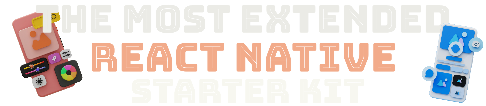

DISCLAIMER
You are not permitted to use this project for commercial use without an Licence signed by Callipson.
Each violation against this will has be legal consequences.

  

# 

# **Ship Apps in Days ✅ Not Months ❌**

This repository provides a streamlined solution for rapidly developing and deploying native mobile applications.

Whether you're working on a personal project or delivering enterprise solutions, this toolkit helps you accelerate the development process.

## Support this Project.

If you find this project helpful or just want to show your appreciation, consider buying me a coffee! Your support helps me to keep maintaining and improving this project. **You can reach my Buy Me a Coffee page [here](https://buymeacoffee.com/calipsow). Thank you for your support!**

## Get Started

Jump right into building and shipping your native app by following our [Getting Started Guide](./documentations/Get_Started.md). This guide will walk you through the initial setup and get you up and running in no time.
**_Some inline comments remaining in german, you can issue this following the guidelines_**

## Key Features

### Firebase Setup and Integration

- Comprehensive Firebase setup including Storage, Analytics, Firestore, and Authentication.
- Seamless integration with Firebase Authentication for managing user accounts.

### Deep Linking and Notifications

- Efficient configuration of deep links and push notifications for both iOS and Android platforms.

### Modular Firebase Functions

- Pre-configured Firebase Functions for handling notifications and other backend tasks.

### Rich UI and User Experience

- Includes templates for user accounts, settings, home pages, feeds, and more.
- Supports advanced UI elements like toast notifications, FBImage components, buttons, and more.

### Documentation and Support

- Detailed documentation on how to set up and use the provided features.
- Step-by-step guides for integrating Firebase and setting up notifications.

### Additional Utilities

- Hooks for handling Firestore, authentication, and deep linking.
- Helper functions for image compression and asynchronous tasks.

## Prewritten Features Overview

- Firebase setup and functions
- Push notification modules
- UI Components with comprehensive features
- Deep linking and routing with ease
- Ready-to-use templates for various screens and functionalities

## User Interface Elements

- Fully customizable screens including Home, Profile, and more.
- Pre-built components for E-Commerce, Calendars, and other advanced features.

## Advanced Features

- Deep linking and authentication handling.
- Complete navigation logic and hooks for seamless user experience.
- Ready-to-use Firebase Functions for handling backend processes.
